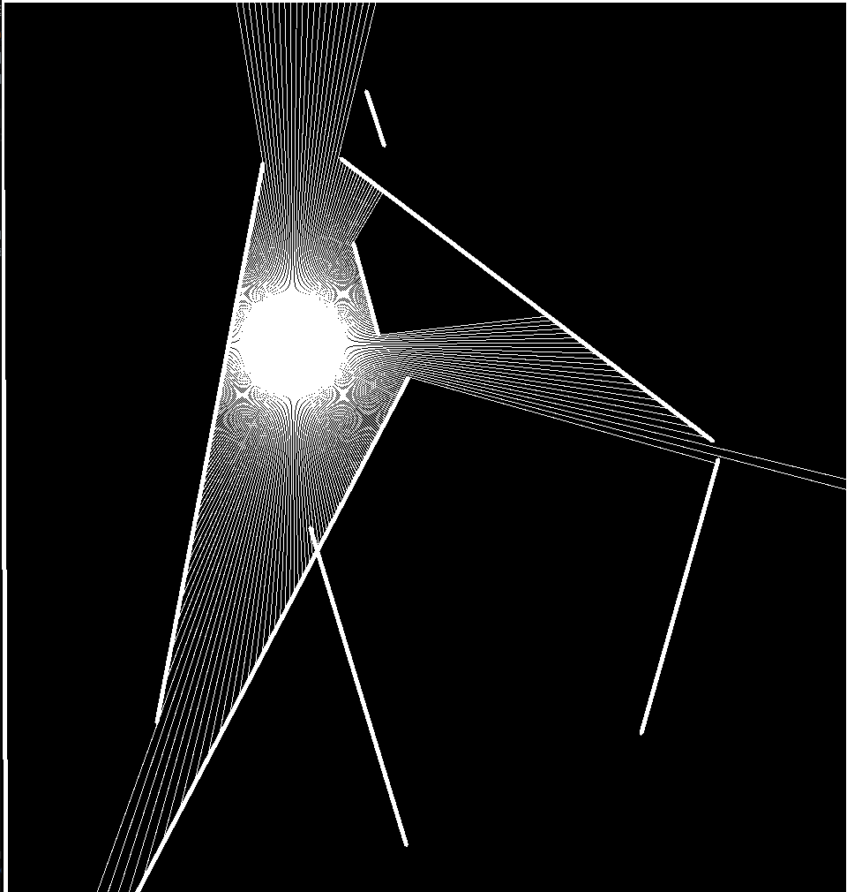

## 2D ray caster

Implementation of a 2D ray caster.

### Entities:

1. **Window**: It is the area which will hold all the other entities, including our light source and boundaries.
2. **Boundaries**: These are randomly generated lines placed within the window area that will act as the obstructions for light.
3. **Particle**: This is a circle that projects lines in all 360 degrees. These lines are rays and the particle acts as our light source.
4. **Rays**: These are lines projected from the particle which act as light rays.

User can use arrow keys to move the light source around and visualise the interactions.

### Steps to build

1. > clone the repository
2. > go build
3. > ./2dRaycasting
